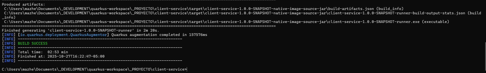

# client-service
Client Service Quarkus Project

## Compilacion

Se compararan los tiempos de los ejecutables

### Comparacion tiempos

#### Usando ejecutable nativo GraalVM
```mvn clean package -Dnative -Dskiptests=true```

-Compilación



#### Usando ejecutable nativo

```mvn clean package -Dnative -Dskiptests=true -Dquarkus.native.container.build=true```
